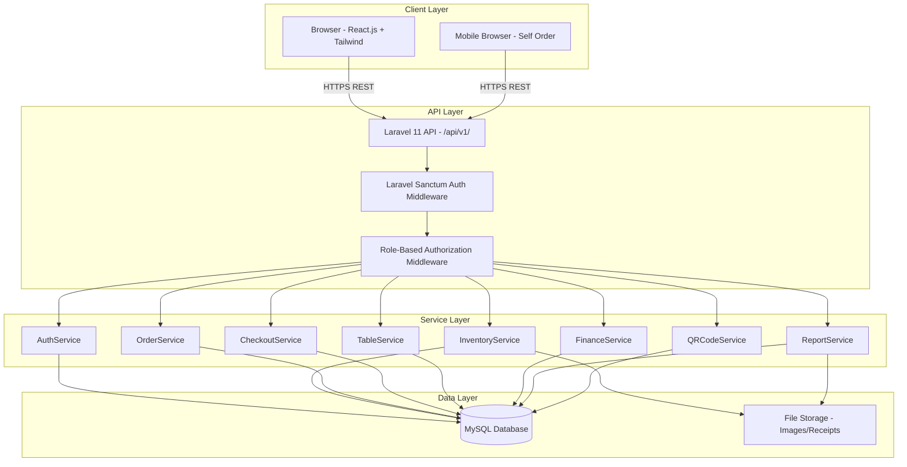
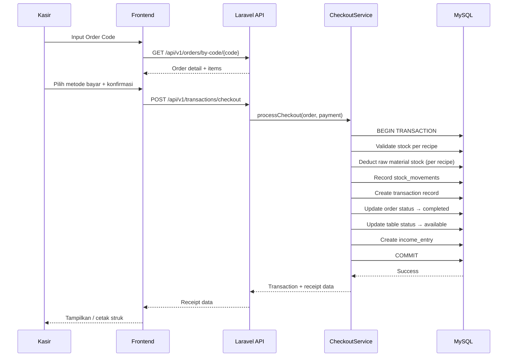

# Design Document: Bar/Resto POS System

## Overview

Sistem POS (Point of Sales) berbasis web untuk Bar/Resto UMKM yang menggabungkan manajemen inventaris berbasis bahan baku, pemesanan hybrid (self-order via QR meja & kasir), proses checkout atomik, pencatatan keuangan, dan pelaporan.

**Tech Stack:**
- Backend: PHP Laravel 11 (RESTful API)
- Database: MySQL 8.x
- Frontend: React.js + Tailwind CSS
- Auth: Laravel Sanctum
- Reporting: DomPDF + Laravel Excel
- QR Code: `simplesoftwareio/simple-qrcode`

**Prinsip Desain Utama:**
- Stok dikelola di level **bahan baku** (raw materials), bukan menu
- Menu memiliki **resep (recipe/BOM)** yang mendefinisikan bahan baku yang dikonsumsi per transaksi
- Checkout bersifat **atomik**: kurangi stok bahan baku via resep, catat transaksi, update status meja — semua dalam satu database transaction
- Self-order pelanggan menghasilkan `order_code` unik yang ditunjukkan ke kasir untuk pembayaran

---

## Architecture

### High-Level Architecture



### Request Flow: Self-Order via QR Meja

```mermaid
sequenceDiagram
    participant P as Pelanggan
    participant FE as Frontend (React)
    participant API as Laravel API
    participant DB as MySQL

    P->>FE: Scan QR Meja (URL: /order?table=TABLE_UUID)
    FE->>API: GET /api/v1/tables/{uuid}/menu
   ilable menus
    DB-->>API: Table info + menu list
    API-->>FE: Table + menu data
    FE-->>P: Tampilkan menu dengan info meja
    P->>FE: Pilih item + submit order
    FE->>API: POST /api/v1/orders (self_order, table_id)
    API->>DB: Validate menu availability
    API->>DB: Create order + order_items
    API->>DB: Update table status → occupied
    DB-->>API: Order created
    API-->>FE: { order_code: "ORD-XXXX" }
    FE-->>P: Tampilkan Order Code / QR
    P->>Kasir: Tunjukkan Order Code
```

### Request Flow: Checkout Atomik



---

## Components and Interfaces

### Backend: Struktur Folder Laravel

```
app/
├── Http/
│   ├── Controllers/
│   │   └── API/
│   │       ├── AuthController.php
│   │       ├── ProductController.php
│   │       ├── StockMovementController.php
│   │       ├── TableController.php
│   │       ├── OrderController.php
│   │       ├── TransactionController.php
│   │       ├── FinanceController.php
│   │       ├── ReportController.php
│   │       └── DashboardController.php
│   ├── Middleware/
│   │   └── RoleMiddleware.php
│   └── Resources/
│       ├── UserResource.php
│       ├── ProductResource.php
│       ├── TableResource.php
│       ├── OrderResource.php
│       ├── OrderItemResource.php
│       ├── TransactionResource.php
│       └── ReceiptResource.php
├── Services/
│   ├── AuthService.php
│   ├── InventoryService.php
│   ├── OrderService.php
│   ├── CheckoutService.php
│   ├── TableService.php
│   ├── QRCodeService.php
│   ├── FinanceService.php
│   └── ReportService.php
├── Repositories/
│   ├── ProductRepository.php
│   ├── OrderRepository.php
│   ├── TableRepository.php
│   └── TransactionRepository.php
└── Models/
    ├── User.php
    ├── Product.php
    ├── Category.php
    ├── Recipe.php
    ├── StockMovement.php
    ├── Table.php
    ├── Order.php
    ├── OrderItem.php
    ├── Transaction.php
    ├── IncomeEntry.php
    └── ExpenseEntry.php
```

### Frontend: Struktur Folder React

```
src/
├── pages/
│   ├── auth/
│   │   └── Login.jsx
│   ├── cashier/
│   │   ├── Dashboard.jsx
│   │   ├── Orders.jsx
│   │   └── Checkout.jsx
│   ├── manager/
│   │   ├── Dashboard.jsx
│   │   ├── Products.jsx
│   │   ├── Tables.jsx
│   │   ├── Reports.jsx
│   │   └── Users.jsx
│   ├── finance/
│   │   ├── Expenses.jsx
│   │   └── Summary.jsx
│   └── customer/
│       └── SelfOrder.jsx
├── components/
│   ├── ui/
│   │   ├── Button.jsx
│   │   ├── Modal.jsx
│   │   ├── Table.jsx
│   │   └── Badge.jsx
│   ├── pos/
│   │   ├── OrderCodeInput.jsx
│   │   ├── ReceiptModal.jsx
│   │   └── PaymentForm.jsx
│   └── charts/
│       └── SalesChart.jsx
├── services/
│   └── api.js          # Axios instance + interceptors
├── stores/
│   └── authStore.js    # Zustand / Context
└── hooks/
    ├── useAuth.js
    └── useOrders.js
```

### Service Layer Interfaces

#### CheckoutService

```php
class CheckoutService
{
    /**
     * Proses checkout secara atomik dalam satu DB transaction.
     * 1. Validasi stok bahan baku via recipe
     * 2. Kurangi stok bahan baku
     * 3. Catat stock_movements
     * 4. Buat transaction record
     * 5. Update order status → completed
     * 6. Update table status → available (jika dine_in/self_order)
     * 7. Buat income_entry
     */
    public function processCheckout(Order $order, array $paymentData): Transaction;

    /** Validasi stok bahan baku mencukupi untuk semua item dalam order */
    public function validateStock(Order $order): void; // throws InsufficientStockException

    /** Kurangi stok bahan baku berdasarkan recipe setiap order item */
    private function deductRawMaterialStock(Order $order, Transaction $transaction): void;
}
```

#### InventoryService

```php
class InventoryService
{
    public function addStock(Product $product, int $quantity, string $reference): StockMovement;
    public function deductStock(Product $product, int $quantity, string $refType, int $refId): StockMovement;
    public function getLowStockItems(): Collection;
    public function checkStockSufficiency(int $productId, int $requiredQty): bool;
}
```

#### QRCodeService

```php
class QRCodeService
{
    /** Generate QR code SVG/PNG untuk meja, idempotent berdasarkan table UUID */
    public function generateTableQR(Table $table): string;

    /** Decode QR code URL → table_uuid */
    public function resolveTableFromQR(string $qrPayload): Table;
}
```

#### OrderService

```php
class OrderService
{
    public function createSelfOrder(array $items, string $tableUuid): Order;
    public function createCashierOrder(array $items, string $type, ?int $tableId): Order;
    public function updateStatus(Order $order, string $status, ?string $reason = null): Order;
    public function findByCode(string $orderCode): Order;
}
```

### API Endpoints

| Method | Path | Auth | Role | Deskripsi |
|--------|------|------|------|-----------|
| POST | `/api/v1/auth/login` | No | - | Login, return Sanctum token |
| POST | `/api/v1/auth/logout` | Yes | All | Revoke token |
| GET | `/api/v1/auth/me` | Yes | All | Data user aktif |
| GET | `/api/v1/products` | Yes | All | List produk/bahan baku |
| POST | `/api/v1/products` | Yes | Head_Manager | Tambah produk |
| GET | `/api/v1/products/{id}` | Yes | All | Detail produk |
k |
| DELETE | `/api/v1/products/{id}` | Yes | Head_Manager | Hapus produk |
| GET | `/api/v1/products/low-stock` | Yes | Kasir, Head_Manager | List stok kritis |
| POST | `/api/v1/stock-movements` | Yes | Kasir, Head_Manager | Catat pergerakan stok |
| GET | `/api/v1/stock-movements` | Yes | Kasir, Head_Manager | Riwayat pergerakan stok |
| GET | `/api/v1/tables` | Yes | Kasir, Head_Manager | List meja + status |
| POST | `/api/v1/tables` | Yes | Head_Manager | Tambah meja |
| GET | `/api/v1/tables/{id}` | Yes | Kasir, Head_Manager | Detail meja |
| PUT | `/api/v1/tables/{id}` | Yes | Head_Manager | Update meja |
| GET | `/api/v1/tables/{id}/qr` | Yes | Head_Manager | Get/generate QR meja |
| GET | `/api/v1/tables/{uuid}/menu` | No | - | Menu untuk self-order (public) |
| GET | `/api/v1/orders` | Yes | Kasir, Head_Manager | List order aktif |
| POST | `/api/v1/orders` | Yes/No | Kasir/Pelanggan | Buat order baru |
| GET | `/api/v1/orders/{id}` | Yes | Kasir, Head_Manager | Detail order |
| PUT | `/api/v1/orders/{id}/status` | Yes | Kasir | Update status order |
| GET | `/api/v1/orders/by-code/{code}` | Yes | Kasir | Lookup order by Order_Code |
| POST | `/api/v1/transactions/checkout` | Yes | Kasir | Proses checkout atomik |
| GET | `/api/v1/transactions/{id}/receipt` | Yes | Kasir | Data struk |
| GET | `/api/v1/expenses` | Yes | Finance, Head_Manager | List pengeluaran |
| POST | `/api/v1/expenses` | Yes | Finance | Tambah pengeluaran |
| GET | `/api/v1/income` | Yes | Finance, Head_Manager | List pemasukan |
| GET | `/api/v1/finance/summary` | Yes | Finance, Head_Manager | Rekap keuangan |
| GET | `/api/v1/reports/stock` | Yes | Finance, Head_Manager | Laporan stok |
| GET | `/api/v1/reports/stock-movement` | Yes | Finance, Head_Manager | Laporan arus barang |
| GET | `/api/v1/reports/profit-loss` | Yes | Finance, Head_Manager | Laporan laba-rugi |
| GET | `/api/v1/dashboard` | Yes | Head_Manager | Data dashboard |

**Query params untuk reports:** `?format=pdf|excel&start_date=YYYY-MM-DD&end_date=YYYY-MM-DD`

---

## Data Models

### Entity Relationship Diagram

```mermaid
erDiagram
    users {
        bigint id PK
        string name
        string email UK
        string password
        enum role "pelanggan|kasir|finance|head_manager"
        boolean is_active
        timestamps created_at
        timestamps updated_at
    }

    categories {
        bigint id PK
        string name
        enum type "product|expense"
        timestamps created_at
        timestamps updated_at
    }

    products {
        bigint id PK
        string sku UK
        string name
        text description
        bigint category_id FK
        string unit
        decimal buy_price
        decimal sell_price
        decimal stock
        decimal low_stock_threshold
        boolean is_available
        string image_path
        timestamps created_at
        timestamps updated_at
    }

    recipes {
        bigint id PK
        bigint menu_product_id FK
        bigint raw_material_id FK
        decimal quantity_required
        string unit
        timestamps created_at
        timestamps updated_at
    }

    stock_movements {
        bigint id PK
        bigint product_id FK
        enum type "in|out"
        decimal quantity
        decimal stock_before
        decimal stock_after
        string reference_type
        bigint reference_id
        text notes
        bigint created_by FK
        timestamps created_at
        timestamps updated_at
    }

    tables {
        bigint id PK
        string table_number UK
        string name
code UK
        int capacity
        enum status "available|occupied|reserved"
        timestamps created_at
        timestamps updated_at
    }

    orders {
        bigint id PK
        string order_number UK
        string order_code UK
        bigint user_id FK
        bigint table_id FK
        bigint created_by FK
        enum order_type "self_order|take_away|dine_in"
        enum status "pending|confirmed|preparing|ready|completed|cancelled"
        text notes
        text cancellation_reason
        timestamps created_at
        timestamps updated_at
    }

    order_items {
        bigint id PK
        bigint order_id FK
        bigint product_id FK
        int quantity
        decimal unit_price
        decimal subtotal
        timestamps created_at
        timestamps updated_at
    }

    transactions {
        bigint id PK
        string transaction_number UK
        bigint order_id FK
        enum payment_method "cash|card|qris"
        decimal total_amount
        decimal paid_amount
        decimal change_amount
        enum status "success|failed|refunded"
        bigint processed_by FK
        timestamps created_at
        timestamps updated_at
    }

    income_entries {
        bigint id PK
        bigint transaction_id FK
        date date
        decimal amount
        string category
        text description
        enum source "pos|manual"
        enum status "pending|validated"
        bigint created_by FK
        timestamps created_at
        timestamps updated_at
    }

    expense_entries {
        bigint id PK
        date date
        decimal amount
        string category
        text description
        string receipt_path
        bigint created_by FK
        timestamps created_at
        timestamps updated_at
    }

    users ||--o{ orders : "created_by"
    users ||--o{ stock_movements : "created_by"
    users ||--o{ transactions : "processed_by"
    users ||--o{ income_entries : "created_by"
    users ||--o{ expense_entries : "created_by"
    categories ||--o{ products : "category_id"
    products ||--o{ recipes : "menu_product_id"
    products ||--o{ recipes : "raw_material_id"
    products ||--o{ stock_movements : "product_id"
    products ||--o{ order_items : "product_id"
    tables ||--o{ orders : "table_id"
    orders ||--o{ order_items : "order_id"
    orders ||--|| transactions : "order_id"
    transactions ||--o| income_entries : "transaction_id"
```

### Catatan Penting: Tabel `recipes`

Tabel `recipes` adalah **Bill of Materials (BOM)** yang menghubungkan menu (pl). Satu menu bisa membutuhkan beberapa bahan baku, dan satu bahan baku bisa digunakan di banyak menu.

- `menu_product_id` → FK ke `products` (item yang dijual ke pelanggan)
- `raw_material_id` → FK ke `products` (bahan baku yang dikurangi stoknya)
- `quantity_required` → jumlah bahan baku yang dikonsumsi per 1 unit menu

**Contoh:** Menu "Mojito" membutuhkan: 30ml Rum, 15ml Simple Syrup, 6 lembar Mint Leaf, 200ml Soda Water.

### Database Indexes

```sql
-- products
s(category_id);
CREATE INDEX idx_products_sku ON products(sku);
CREATE INDEX idx_products_is_available ON products(is_available);

-- stock_movements
CREATE INDEX idx_stock_movements_product ON stock_movements(product_id);
CREATE INDEX idx_stock_movements_created_at ON stock_movements(created_at);
CREATE INDEX idx_stock_movements_reference ON stock_movements(reference_type, reference_id);

-- orders
CREATE INDEX idx_orders_status ON orders(status);
CREATE INDEX idx_orders_table ON orders(table_id);
CREATE INDEX idx_orders_created_at ON orders(created_at);
CREATE INDEX idx_orders_order_code ON orders(order_code);

-- transactions
CREATE INDEX idx_transactions_order ON transactions(order_id);
CREATE INDEX idx_transactions_created_at ON transactions(created_at);

-- income_entries / expense_entries
CREATE INDEX idx_income_date ON income_entries(date);
CREATE INDEX idx_expense_date ON expense_entries(date);
```

### Contoh Implementasi: CheckoutController + CheckoutService

```php
// app/Http/Controllers/API/troller.php
class TransactionController extends Controller
{
    public function __construct(private CheckoutService $checkoutService) {}

    public function checkout(CheckoutRequest $request): JsonResponse
    {
        $order = Order::where('order_code', $request->order_code)
            ->whereIn('status', ['pending', 'confirmed', 'ready'])
            ->firstOrFail();

        $transaction = $this->checkoutService->processCheckout($order, $request->validated());

        return response()->json([
            'data' => new ReceiptResource($transaction),
        ], 201);
    }
}
```

```php
// app/Services/CheckoutService.php
class CheckoutService
{
    public function processCheckout(Order $order, array $paymentData): Transaction
    {
        // Validasi stok sebelum memulai DB transaction
        $this->validateStock($order);

        return DB::transaction(function () use ($order, $paymentData) {
            // 1. Buat transaction record
            $transaction = Transaction::create([
action_number' => 'TRX-' . now()->format('YmdHis') . '-' . $order->id,
                'order_id'           => $order->id,
                'payment_method'     => $paymentData['payment_method'],
                'total_amount'       => $order->orderItems->sum('subtotal'),
                'paid_amount'        => $paymentData['paid_amount'],
                'change_amount'      => $paymentData['paid_amount'] - $order->orderItems->sum('subtotal'),
                'status'             => 'success',
                processed_by'       => auth()->id(),
            ]);

            // 2. Kurangi stok bahan baku via recipe
            $this->deductRawMaterialStock($order, $transaction);

            // 3. Update status order
            $order->update(['status' => 'completed']);

            // 4. Update status meja jika dine_in atau self_order
            if ($order->table_id && in_array($order->order_type, ['dine_in', 'self_order'])) {
                $order->table->update(['status' => 'available']);
            }

            // 5. Buat income entry
            IncomeEntry::create([
                'transaction_id' => $transaction->id,
                'date'           => now()->toDateString(),
                'amount'         => $transaction->total_amount,
                'category'       => 'Penjualan',
                'source'         => 'pos',
                'status'         => 'pending',
                'created_by'     => auth()->id(),
            ]);

            return $transaction;
        });
    }

    public function validateStock(Order $order): void
    {
        $insufficientItems = [];

        foreach ($order->orderItems as $item) {
            $recipes = Recipe::where('menu_product_id', $item->product_id)->get();

            foreach ($recipes as $recipe) {
                $required = $recipe->quantity_required * $item->quantity;
                $rawMaterial = Product::find($recipe->raw_material_id);

                if ($rawMaterial->stock < $required) {
                    $insufficientItems[] = [
                        'raw_material' => $rawMaterial->name,
                        'required'     => $required,
                        'available'    => $rawMaterial->stock,
                    ];
                }
            }
        }

        if (!empty($insufficientItems)) {
            throw new InsufficientStockException($insufficientItems);
        }
    }

    private function deductRawMaterialStock(Order $order, Transaction $transaction): void
    {
        foreach ($order->orderItems as $item) {
            $recipes = Recipe::where('menu_product_id', $item->product_id)->get();

            foreach ($recipes as $recipe) {
                $rawMaterial = Product::lockForUpdate()->find($recipe->raw_material_id);
                $deductQty   = $recipe->quantity_required * $item->quantity;
                $stockBefore = $rawMaterial->stock;

                $rawMaterial->decrement('stock', $deductQty);

                StockMovement::create([
                    'product_id'     => $rawMaterial->id,
pe'           => 'out',
                    'quantity'       => $deductQty,
                    'stock_before'   => $stockBefore,
                    'stock_after'    => $stockBefore - $deductQty,
                    'reference_type' => 'transaction',
                    'reference_id'   => $transaction->id,
                    'notes'          => "Checkout order #{$order->order_number}",
                    'created_by'     => auth()->id(),
                ]);
            }
        }
    }
}
```

### Alur QR Code: Generate, Scan, Lookup

```mermaid
flowchart LR
    A[Head_Manager: Tambah Meja] --> B[TableService::create]
    B --> C[QRCodeService::generateTableQR]
    C --> D["QR payload: APP_URL/order?table={table.uuid}"]
    D --> E[Simpan qr_code string ke DB]
    E --> F[Return QR image SVG/PNG]

    G[Pelanggan: Scan QR Meja] --> H["Browser buka: /order?table={uuid}"]
    H --> I[Frontend: GET /api/v1/tables/{uuid}/menu]
    I --> J[API: Lookup table by uuid, return menu]
    Jnfo meja]
    K --> L[POST /api/v1/orders dengan table_id]
    L --> M[Return order_code ke pelanggan]
```

### Contoh Snippet Tailwind CSS: Dashboard Manager

```jsx
// src/pages/manager/Dashboard.jsx
export default function ManagerDashboard() {
  return (
    <div className="min-h-screen bg-gray-50 p-4 md:p-8">
      {/* Header */}
      <h1 className="text-2xl font-bold text-gray-800 mb-6">Dashboard</h1>

      {/* Stats Grid */}
      <div className="grid grid-cols-2 lg:grid-cols-4 gap-4 mb-8">
        <StatCard title="Penjualan Hari Ini" value="Rp 2.450.000" icon="💰" color="bg-green-100 text-green-800" />
        <StatCard title="Total Transaksi" value="34" icon="🧾" color="bg-blue-100 text-blue-800" />
        <StatCard title="Stok Kritis" value="5 item" icon="⚠️" color="bg-red-100 text-red-800" />
        <StatCard title="Meja Terisi" value="8 / 12" icon="🪑" color="bg-yellow-100 text-yellow-800" />
      </div>

      {/* Chart + Low Stock */}
      <div className="grid grid-cols-1 lg:gr">
        <div className="lg:col-span-2 bg-white rounded-2xl shadow p-6">
          <h2 className="text-lg font-semibold text-gray-700 mb-4">Penjualan 7 Hari Terakhir</h2>
          {/* <SalesChart /> */}
        </div>
        <div className="bg-white rounded-2xl shadow p-6">
          <h2 className="text-lg font-semibold text-gray-700 mb-4">Stok Kritis</h2>
          <ul className="space-y-2">
            {/* low stock items */}
          </ul>
        </div>
      </div>
    </div>
  );
}

function StatCard({ title, value, icon, color }) {
  return (
    <div className={`rounded-2xl p-4 ${color} flex items-center gap-3`}>
      <span className="text-3xl">{icon}</span>
      <div>
        <p className="text-sm font-medium opacity-75">{title}</p>
        <p className="text-xl font-bold">{value}</p>
      </div>
    </div>
  );
}
```

---


## Correctness Properties

*A property is a characteristic or behavior that should hold true across all valid executions of a system — essentially, a formal statement about what the system should do. Properties serve as the bridge between human-readable specifications and machine-verifiable correctness guarantees.*

### Property 1: Valid Login Returns Token dan Role

*For any* user dengan kredensial yang valid (email + password benar), proses login SHALL mengembalikan response yang mengandung token autentikasi dan data role pengguna yang sesuai.

**Validates: Requirements 1.2**

---

### Property 2: Role-Based Access Control

*For any* endpoint yang dilindungi dan *for any* user dengan role tertentu, akses SHALL diberikan jika dan hanya jika role user tersebut termasuk dalam daftar role yang diizinkan untuk endpoint tersebut.

**Validates: Requirements 1.6**

---

### Property 3: Password Tersimpan Sebagai Bcrypt Hash

*For any* user yang dibuat oleh Head_Manager, nilai kolom `password` yang tersimpan di database SHALL berupa bcrypt hash dan TIDAK PERNAH berupa plaintext dari password asli.

**Validates: Requirements 1.7**

---

### Property 4: Deaktivasi User Mencabut Semua Token

*For any* user yang memiliki satu atau lebih token aktif, ketika Head_Manager menonaktifkan user tersebut, semua token aktif milik user tersebut SHALL menjadi tidak valid dan ditolak oleh sistem.

**Validates: Requirements 1.8**

---

### Property 5: SKU Bersifat Unik

*For any* dua item stok yang berbeda, keduanya SHALL memiliki nilai SKU yang berbeda. Upaya menyimpan item dengan SKU yang sudah ada SHALL ditolak oleh sistem.

**Validates: Requirements 2.2**

---

### Property 6: Stock Movement Round-Trip

*For any* item stok dan *for any* jumlah pergerakan stok (masuk atau keluar), setelah pergerakan dicatat: (a) nilai `stock` item SHALL berubah sebesar jumlah pergerakan tersebut, dan (b) SHALL ada record baru di `stock_movements` dengan `stock_before`, `stock_after`, dan `quantity` yang konsisten (`stock_after = stock_before ± quantity`).

**Validates: Requirements 2.4, 2.5, 2.9**

---

### Property 7: Low Stock Threshold Detection

*For any* item stok dengan `low_stock_threshold` yang ditetapkan, jika nilai `stock` item tersebut ≤ `low_stock_threshold`, maka item tersebut SHALL muncul dalam daftar low-stock. Jika `stock` > `low_stock_threshold`, item tersebut SHALL TIDAK muncul dalam daftar low-stock.

**Validates: Requirements 2.6, 2.7, 2.8**

---

### Property 8: Menu Visibility Berdasarkan Ketersediaan

*For any* menu dengan `is_available = false`, menu tersebut SHALL TIDAK muncul dalam daftar menu yang dikembalikan ke Pelanggan (public endpoint). *For any* menu dengan `is_available = true`, menu tersebut SHALL muncul dalam daftar tersebut.

**Validates: Requirements 3.2**

---

### Property 9: Harga Menu Terbaru Digunakan di Order Baru

*For any* menu yang harganya diperbarui, semua order yang dibuat SETELAH pembaruan harga SHALL menggunakan harga baru sebagai `unit_price` di `order_items`.

**Validates: Requirements 3.3**

---

### Property 10: Filter Menu Berdasarkan Kategori

*For any* query filter kategori, semua menu yang dikembalikan SHALL memiliki `category_id` yang sesuai dengan kategori yang diminta, dan TIDAK ADA menu dari kategori lain yang ikut dikembalikan.

**Validates: Requirements 3.5**

---

### Property 11: Table Number Bersifat Unik

*For any* dua meja yang berbeda, keduanya SHALL memiliki `table_number` yang berbeda. Upaya menyimpan meja dengan `table_number` yang sudah ada SHALL ditolak oleh sistem.

**Validates: Requirements 4.2**

---

### Property 12: QR Code Di-generate Otomatis Saat Meja Dibuat

*For any* meja yang berhasil disimpan ke database, kolom `qr_code` SHALL berisi nilai yang tidak null dan tidak kosong, yang di-generate secara otomatis oleh sistem.

**Validates: Requirements 4.4**

---

### Property 13: QR Code Generation Bersifat Idempotent

*For any* meja yang terdaftar, memanggil fungsi generate QR code berkali-kali SHALL selalu menghasilkan QR code yang mengarah ke identitas meja yang sama (URL/payload yang ekuivalen).

**Validates: Requirements 4.10**

---

### Property 14: Self-Order Menghasilkan Order Code Unik

*For any* kumpulan self-orders yang dibuat, setiap order SHALL memiliki `order_code` yang unik — tidak ada dua order yang memiliki `order_code` yang sama.

**Validates: Requirements 5.2**

---

### Property 15: Dine-In Memerlukan Meja Berstatus Available

*For any* permintaan order dengan tipe `dine_in`, jika meja yang dipilih memiliki status selain `available`, maka order SHALL ditolak dengan pesan error yang menyebutkan nomor meja dan status saat ini.

**Validates: Requirements 5.4**

---

### Property 16: Table Status Lifecycle

*For any* meja yang terhubung ke order bertipe `dine_in` atau `self_order`: (a) ketika order berhasil dibuat, status meja SHALL berubah menjadi `occupied`; (b) ketika order diperbarui menjadi `completed` atau `cancelled`, status meja SHALL kembali menjadi `available`.

**Validates: Requirements 5.6, 5.9**

---

### Property 17: Validasi Jumlah Pembayaran

*For any* proses checkout, jika `paid_amount` < `total_amount` order, maka checkout SHALL ditolak. Checkout hanya SHALL diproses jika `paid_amount` ≥ `total_amount`.

**Validates: Requirements 6.3**

---

### Property 18: Atomisitas Checkout

*For any* checkout yang berhasil diproses, ketiga kondisi berikut SHALL terpenuhi secara bersamaan: (a) stok bahan baku berkurang sesuai resep × qty, (b) record transaksi tersimpan di database, dan (c) status order berubah menjadi `completed`. Jika salah satu gagal (misalnya stok tidak cukup), TIDAK ADA dari ketiga kondisi tersebut yang terjadi (rollback penuh).

**Validates: Requirements 6.4, 6.5**

---

### Property 19: Struk Mengandung Semua Field yang Diperlukan

*For any* transaksi yang berhasil, data struk yang dikembalikan SHALL mengandung semua field berikut: nomor transaksi, tanggal/waktu, nomor meja (jika dine_in/self_order), daftar item dengan harga, subtotal per item, total, jumlah bayar, dan kembalian.

**Validates: Requirements 6.6**

---

### Property 20: Kalkulasi Kembalian yang Benar

*For any* transaksi tunai dengan `paid_amount` ≥ `total_amount`, nilai `change_amount` yang tersimpan dan ditampilkan SHALL selalu sama dengan `paid_amount - total_amount`.

**Validates: Requirements 6.8**

---

### Property 21: Kalkulasi Summary Keuangan

*For any* kumpulan income_entries dan expense_entries dalam suatu periode, nilai `total_income`, `total_expense`, dan `net_profit` yang dikembalikan oleh finance summary SHALL konsisten: `net_profit = total_income - total_expense`.

**Validates: Requirements 7.5**

---

### Property 22: Kelengkapan Data Laporan Stok

*For any* laporan stok yang di-generate, laporan tersebut SHALL mengandung semua item yang ada di database (tidak ada yang terlewat), dengan nilai `stock`, `stock_value` (buy_price × stock), dan status low-stock yang akurat untuk setiap item.

**Validates: Requirements 8.1**

---

### Property 23: Round-Trip Data Numerik PDF/Excel

*For any* data laporan yang valid, nilai-nilai numerik (total pemasukan, total pengeluaran, laba/rugi, jumlah stok, nilai stok) yang terdapat dalam ekspor PDF SHALL identik dengan nilai yang terdapat dalam ekspor Excel untuk data dan periode yang sama.

**Validates: Requirements 8.9**

---

### Property 24: Database Constraint Enforcement

*For any* upaya insert atau update yang melanggar foreign key constraint atau unique constraint yang didefinisikan di schema, database SHALL menolak operasi tersebut dan sistem SHALL mengembalikan error yang sesuai tanpa mengubah state database.

**Validates: Requirements 10.11**

---

## Error Handling

### Strategi Umum

Semua error dikembalikan dalam format JSON yang konsisten:

```json
{
  "success": false,
  "message": "Deskripsi error yang dapat dibaca manusia",
  "errors": {
    "field_name": ["Pesan validasi spesifik"]
  },
  "code": "ERROR_CODE"
}
```

### HTTP Status Codes

| Kode | Kondisi |
|------|---------|
| 200 | Sukses (GET, PUT) |
| 201 | Resource berhasil dibuat (POST) |
| 400 | Bad Request — validasi input gagal |
| 401 | Unauthorized — token tidak ada, tidak valid, atau kedaluwarsa |
| 403 | Forbidden — role tidak memiliki izin |
| 404 | Not Found — resource tidak ditemukan |
| 409 | Conflict — duplikat SKU, table_number, dll |
| 422 | Unprocessable Entity — stok tidak cukup, pembayaran kurang |
| 500 | Internal Server Error — error tak terduga |

### Custom Exceptions

```php
// app/Exceptions/InsufficientStockException.php
// Dilempar saat stok bahan baku tidak mencukupi untuk checkout
// HTTP 422, berisi daftar item yang kekurangan stok

// app/Exceptions/InvalidPaymentException.php
// Dilempar saat paid_amount < total_amount
// HTTP 422

// app/Exceptions/TableNotAvailableException.php
// Dilempar saat meja yang dipilih untuk dine_in tidak berstatus available
// HTTP 409, berisi nomor meja dan status saat ini

// app/Exceptions/OrderAlreadyProcessedException.php
// Dilempar saat Order_Code yang diinput sudah pernah diproses
// HTTP 409
```

### Error Handling di CheckoutService

Checkout menggunakan `DB::transaction()` — jika exception apapun dilempar di dalam blok transaction, Laravel secara otomatis melakukan rollback. Ini menjamin atomisitas (Property 18).

```php
try {
    $transaction = $this->checkoutService->process($order, $paymentData);
} catch (InsufficientStockException $e) {
    return response()->json(['success' => false, 'message' => $e->getMessage(), 'errors' => $e->getItems()], 422);
} catch (InvalidPaymentException $e) {
    return response()->json(['success' => false, 'message' => $e->getMessage()], 422);
}
```

### Validasi Input

Semua request divalidasi menggunakan Laravel Form Request classes:

- `LoginRequest` — validasi email + password
- `CreateOrderRequest` — validasi items, table_id (jika dine_in), order_type
- `CheckoutRequest` — validasi order_code, payment_method, paid_amount
- `CreateProductRequest` — validasi SKU unik, nama, harga, dll
- `ReportRequest` — validasi start_date ≤ end_date, format pdf/excel

---

## Testing Strategy

### Pendekatan Dual Testing

Sistem ini menggunakan dua pendekatan testing yang saling melengkapi:

1. **Unit/Feature Tests** — menguji contoh spesifik, edge cases, dan integrasi antar komponen
2. **Property-Based Tests** — menguji properti universal yang harus berlaku untuk semua input yang valid

### Library Property-Based Testing

**Backend (PHP):** [`eris/eris`](https://github.com/giorgiosironi/eris) atau [`phpunit/phpunit`](https://phpunit.de/) dengan data provider yang di-generate secara acak.

Alternatif yang lebih mature: **`infection/infection`** untuk mutation testing + custom data generators.

Untuk property-based testing yang sesungguhnya di PHP, gunakan **`giorgiosironi/eris`**:

```bash
composer require --dev giorgiosironi/eris
```

**Frontend (JavaScript/React):** [`fast-check`](https://github.com/dubzzz/fast-check)

```bash
npm install --save-dev fast-check
```

### Konfigurasi Property Tests

- Minimum **100 iterasi** per property test
- Setiap property test harus memiliki komentar referensi ke design property
- Format tag: `Feature: bar-resto-pos-system, Property {N}: {property_text}`

### Unit Tests (Feature Tests Laravel)

Fokus pada:
- Contoh spesifik yang mendemonstrasikan perilaku benar
- Integrasi antar komponen (Controller → Service → Repository → DB)
- Edge cases dan kondisi error

```php
// Contoh: tests/Feature/CheckoutTest.php
class CheckoutTest extends TestCase
{
    /** @test */
    public function checkout_fails_when_stock_is_insufficient()
    {
        // Arrange: buat order dengan item yang stoknya 0
        $order = Order::factory()->withItems()->create();
        RawMaterial::where('id', ...)->update(['stock' => 0]);

        // Act
        $response = $this->postJson('/api/v1/transactions/checkout', [...]);

        // Assert
        $response->assertStatus(422);
        $this->assertDatabaseMissing('transactions', ['order_id' => $order->id]);
        $this->assertEquals('pending', $order->fresh()->status); // rollback
    }

    /** @test */
    public function checkout_is_atomic_on_success()
    {
        // Verifikasi semua 3 kondisi terpenuhi sekaligus (Property 18)
    }
}
```

### Property-Based Tests

Setiap Correctness Property di atas diimplementasikan sebagai satu property-based test:

```php
// Contoh: tests/Property/StockMovementPropertyTest.php
// Feature: bar-resto-pos-system, Property 6: Stock Movement Round-Trip

use Eris\Generator;
use Eris\TestTrait;

class StockMovementPropertyTest extends TestCase
{
    use TestTrait;

    /** @test */
    public function stock_movement_maintains_consistency()
    {
        $this
            ->minimumEvaluationRatio(1.0)
            ->forAll(
                Generator\pos(),  // quantity masuk (positif)
                Generator\pos()   // stock awal
            )
            ->then(function ($quantity, $initialStock) {
                $material = RawMaterial::factory()->create(['stock' => $initialStock]);
                $stockBefore = $material->stock;

                app(InventoryService::class)->addStock($material, $quantity, 'test');

                $material->refresh();
                $movement = StockMovement::latest()->first();

                // stock_after = stock_before + quantity
                $this->assertEquals($stockBefore + $quantity, $material->stock);
                $this->assertEquals($stockBefore, $movement->stock_before);
                $this->assertEquals($stockBefore + $quantity, $movement->stock_after);
                $this->assertEquals($quantity, $movement->quantity);
            });
    }
}
```

```javascript
// Contoh: src/__tests__/changeCalculation.property.test.js
// Feature: bar-resto-pos-system, Property 20: Change Calculation Correctness

import fc from 'fast-check';
import { calculateChange } from '../utils/pos';

test('change = paid - total for all valid payments', () => {
  fc.assert(
    fc.property(
      fc.integer({ min: 1, max: 10_000_000 }), // total
      fc.integer({ min: 0, max: 10_000_000 }),  // extra paid
      (total, extra) => {
        const paid = total + extra;
        const change = calculateChange(total, paid);
        return change === paid - total;
      }
    ),
    { numRuns: 100 }
  );
});
```

### Mapping Property ke Test

| Property | Test File | Iterasi |
|----------|-----------|---------|
| P1: Valid login returns token + role | `tests/Property/AuthPropertyTest.php` | 100 |
| P2: Role-based access control | `tests/Property/RoleAccessPropertyTest.php` | 100 |
| P3: Password as bcrypt hash | `tests/Property/PasswordHashPropertyTest.php` | 100 |
| P4: Deactivation revokes tokens | `tests/Property/UserDeactivationPropertyTest.php` | 100 |
| P5: SKU uniqueness | `tests/Property/SkuUniquenessPropertyTest.php` | 100 |
| P6: Stock movement round-trip | `tests/Property/StockMovementPropertyTest.php` | 100 |
| P7: Low stock threshold detection | `tests/Property/LowStockPropertyTest.php` | 100 |
| P8: Menu visibility | `tests/Property/MenuVisibilityPropertyTest.php` | 100 |
| P9: Menu price update | `tests/Property/MenuPricePropertyTest.php` | 100 |
| P10: Menu category filter | `tests/Property/MenuFilterPropertyTest.php` | 100 |
| P11: Table number uniqueness | `tests/Property/TableUniquenessPropertyTest.php` | 100 |
| P12: QR auto-generation | `tests/Property/QrCodeGenerationPropertyTest.php` | 100 |
| P13: QR idempotency | `tests/Property/QrCodeIdempotencyPropertyTest.php` | 100 |
| P14: Unique order codes | `tests/Property/OrderCodeUniquenessPropertyTest.php` | 100 |
| P15: Dine-in table validation | `tests/Property/DineInTablePropertyTest.php` | 100 |
| P16: Table status lifecycle | `tests/Property/TableStatusLifecyclePropertyTest.php` | 100 |
| P17: Payment amount validation | `tests/Property/PaymentValidationPropertyTest.php` | 100 |
| P18: Checkout atomicity | `tests/Property/CheckoutAtomicityPropertyTest.php` | 100 |
| P19: Receipt completeness | `tests/Property/ReceiptCompletenessPropertyTest.php` | 100 |
| P20: Change calculation | `src/__tests__/changeCalculation.property.test.js` | 100 |
| P21: Finance summary calculation | `tests/Property/FinanceSummaryPropertyTest.php` | 100 |
| P22: Report completeness | `tests/Property/ReportCompletenessPropertyTest.php` | 100 |
| P23: PDF/Excel round-trip | `tests/Property/ReportRoundTripPropertyTest.php` | 100 |
| P24: DB constraint enforcement | `tests/Property/DatabaseConstraintPropertyTest.php` | 100 |

### Panduan Menjalankan Tests

```bash
# Backend: semua tests
php artisan test

# Backend: hanya property tests
php artisan test --filter=Property

# Backend: hanya feature tests
php artisan test --filter=Feature

# Frontend: property tests
npm test -- --run src/__tests__/*.property.test.js
```
